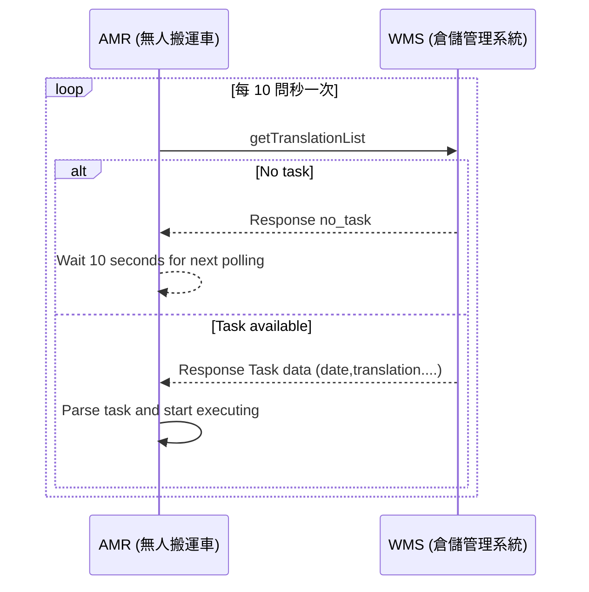
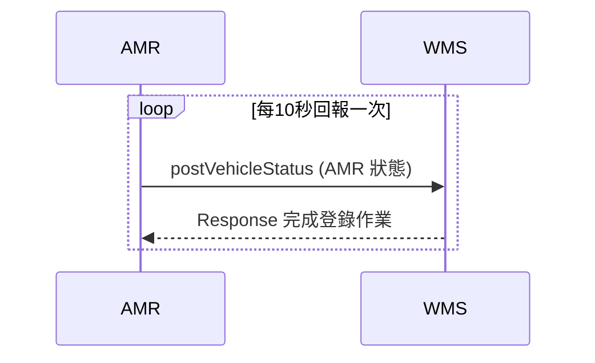

# AMR 派車系統規格書（HTTPS 通訊版）
---
## 1. 總覽
本規格書定義了自動搬運車（AMR）與WMS系統之間的 HTTPS 通訊協定。

- **通訊協定**：HTTPS
- **傳輸格式**：JSON
- **系統架構**：
  - **WMS Server**：倉儲管理系統伺服器，提供WebAPI服務。
  - **AMR Client**：自動搬運車端，主動呼叫WMS系統API。

---


## 2. API 定義
基礎URL
```
http://[WMS系統IP]:[端口]/api/
```
---
## 3. API 規格

### 3.1 AMR取得任務清單
**API 端點**：
```
getTranslationList.php?STATE=0
```
**請求參數：**
```json
{
  "STATE":"任務狀態",
}
```
- **任務狀態定義：**  
  - STATE=0（未執行）
  - STATE=1（執行中）
  - STATE=2（已完成）
  - STATE=3（取消）
  - STATE=空白（全部）

**回應範例**：依據getTranslationList所請求的參數回應,如無帶參數(空白),請回覆全部的任務。

無任務回應範例:

```json
{
  "ret": "true",
  "message":"no_task"
}
```
有任務回應範例(若有多個任務，請依序回應):

```json
{
  "ret": "true",
  "data":
    [
        {
            "date":"12:31:05(登記時間)",
            "translation":"1(任務流水號)",
            "Start":"1001(起始點)",
            "Stop1":"1005(停靠點1)",
            "Stop2":"1007（停靠點2)",
            "End":"1001(到達點)",
            "vehicle":"1(指定搬運車編號)",
            "priority":"1(優先順序)"
            "state":"0(任務狀態)",
        },
        {
            "date":"12:31:10",
            "translation":"2",
            "Start":"2001",
            "Stop1":"2005",
            "Stop2":"2006",
            "Stop2":"2009",
            "End":"2001",
            "vehicle":"2",
            "priority":"1"
            "state":"0",
        }
    ]
}
```

- **優先順序定義：**  
  - 緊急：0 (若會優先會插入任務)
  - 普通：1（依照任務的時間順序處理)  

**取消任務** : 只能取消任務狀態**未執行**的任務，執行中的任務無法取消。
  請直接把State 狀態為0 的任務，改成 State = 3 即可取消任務。

```json
{
  "ret": "true",
  "data":
    [
        {
            "date":"12:31:05",
            "translation":"1",
            "Start":"1001",
            "Stop1":"1005",
            "Stop2":"1007",
            "End":"1001",
            "vehicle":"1",
            "priority":"1"
            "state":"3",
        }
    ]
}

```

**時序圖getTranslationList**：


---

### 3.2 AMR回報位置、電量、狀態及異常
**API 端點**：  
```
postVehicleStatus.php?VEHICLE=1&POSITION=1003&POWER=75&STATUS=1& ERROR=0
```

**請求參數**：會將每一台AMR 的狀態同時POST 出去
```json
[
  {
    "VEHCILE":"1(搬運車編號)",
    "POSITION":"2001(現在位置)",
    "POWER":"70(電量 1 - 100)",
    "STATUS":"2(搬運車狀態)",
    "ERROR":"1(異常代碼)",
  },
  {
    "VEHCILE":"2",
    "POSITION":"1005",
    "POWER":"95",
    "STATUS":"1",
    "ERROR":"0",
  }
]
```
- **搬運車狀態定義：**
  - STATUS=0（待命中）
  - STATUS=1（工作中）
  - STATUS=2（充電中）
  - STATUS=3（有異常狀況）
  - STATUS=4（無開機或連線異常）

- **異常代碼定義：**  
  - ERROR=0（無異常）
  - ERROR=1（電池電量過低）
  - ERROR=2（圖資須更新）
  - ERROR=3（有障礙物）

**回應範例**：
```json
{
  "ret": "true",
  "message": "完成登錄作業", 
}
```
**時序圖postVehicleStatus**：



---

### 3.3 回報執行中和已完成的派遣任務
**API 端點**：  
```
postTranslationState.php?VEHCILE=1&TRANSLATION=2&STATE=1
```

**請求參數**：會將每一個執行中和已完成的派遣任務同時POST 出去

```json
{
  "VEHCILE": "搬運車編號",
  "TRANSLATION": "任務流水號",
  "STATE": "任務狀態"
}
```
- **任務狀態定義：**  
  - STATE=1（執行中)
  - STATE=2（已完成）


**回應範例**：
```json
{
  "ret": "true",
  "message": "完成登錄作業", 
}
```

**時序圖postVehicleStatus**：


---


## 4. 版本管理
- **版本**：v1.0.0　新建
- **最後更新**：2025-10-07
- **編制者**：Athena  
