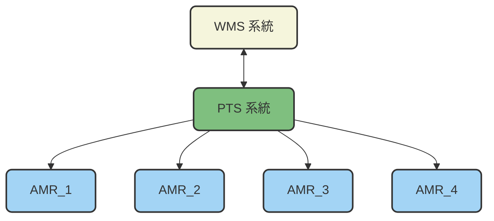
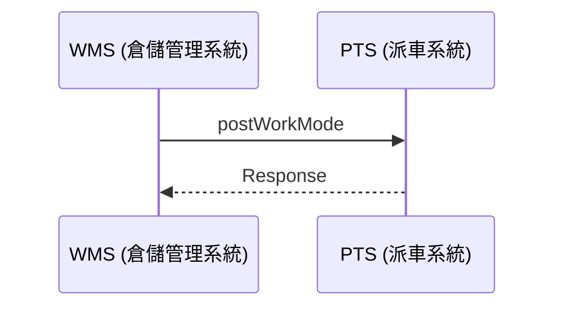
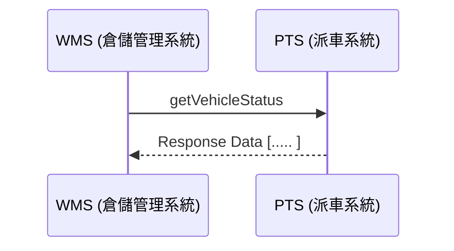
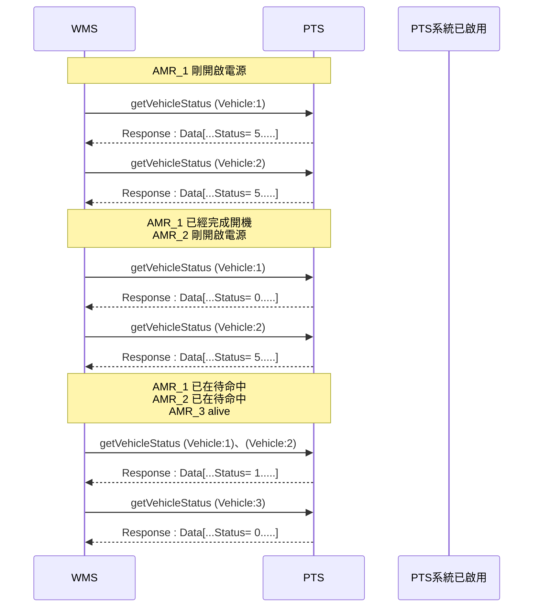
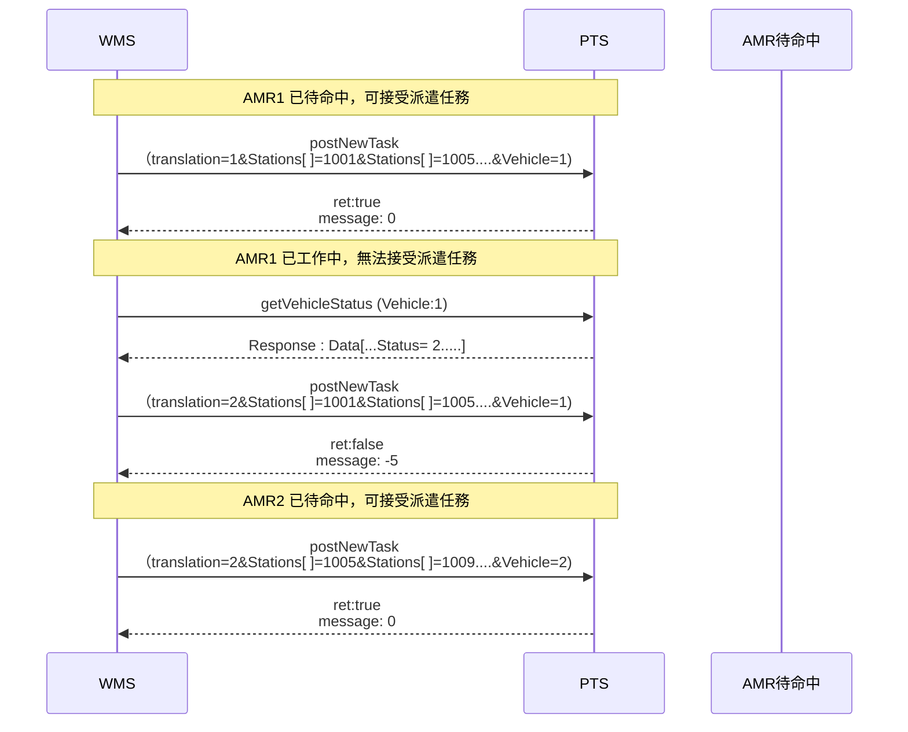
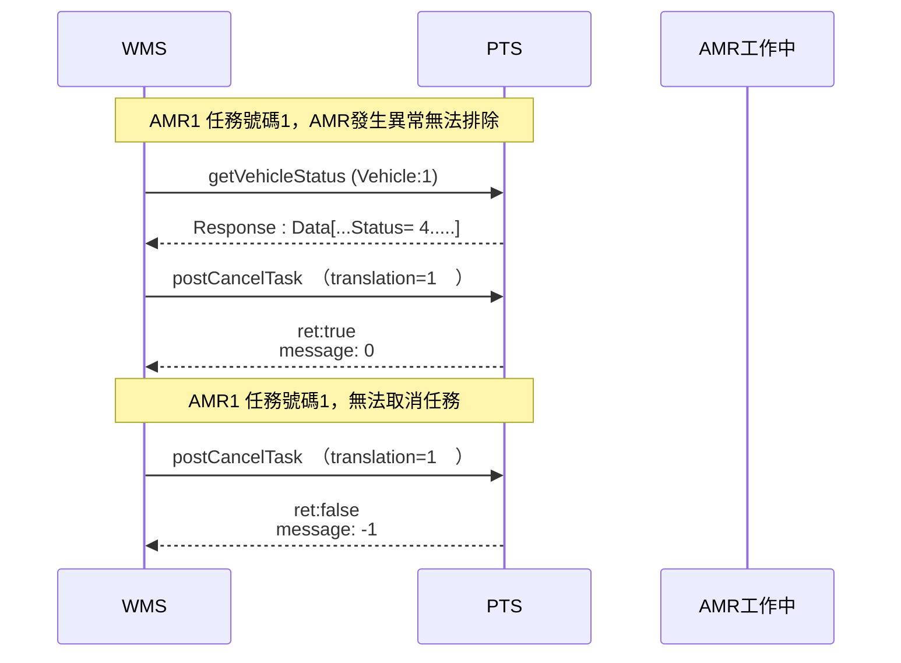
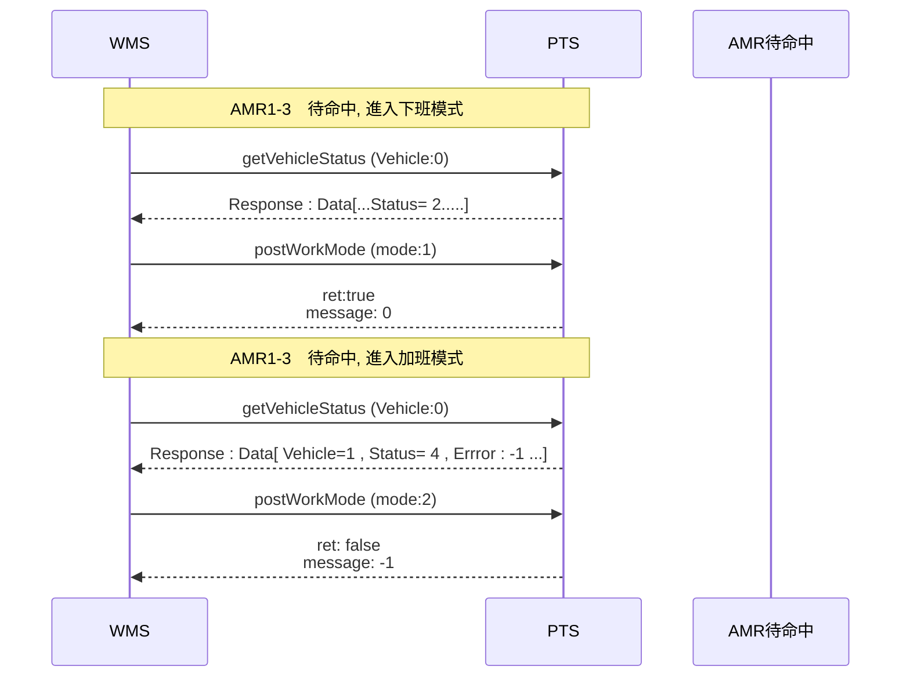
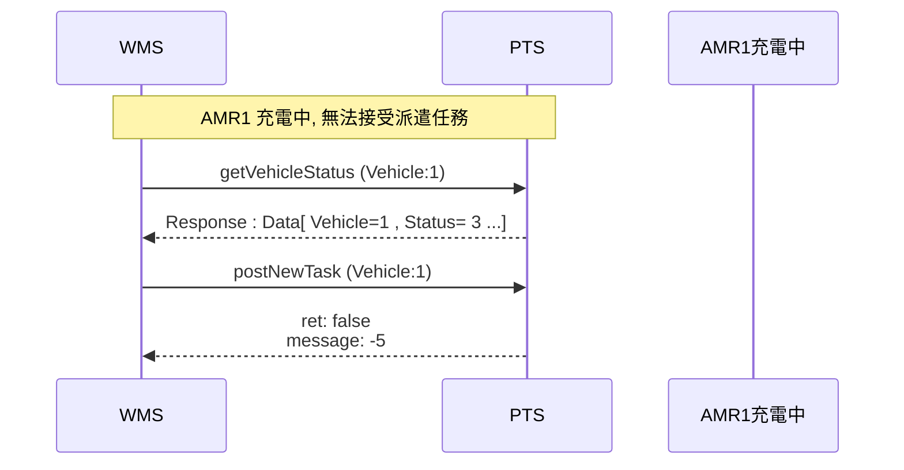

# 規劃與運輸系統 <br>Planning and Transport System（PTS） <br>和倉儲管理系統<br>Warehouse Management System (WMS)<br>HTTPS 通訊規格書

## 0. 版本管理
|版本 | 更新| 編制者 |
|:------|:------|:------|
| v1.0.0　新建| 2025-10-27 |Athena |


## 1. 總覽

本規格書定義了規劃與運輸系統（PTS）與倉儲管理系統(WMS)之間的 HTTPS 通訊協定。倉儲管理系統(WMS)與規劃與運輸系統(PTS)，透過WebAPI進行通訊，使用HTTPS協議傳輸JSON格式資料。
<br>
<br>

- **通訊協定：** HTTPS
- **傳輸格式：** JSON
- **系統架構圖：**

<br>
<br>



## 2. API 定義規格


基礎URL
```
https://[PTS系統IP]:[端口]/api/
```

|項目 | 說明| 類別 | 方法 |
|:------|:------|:------|:-----|
| 1| 新增派遣任務 | postNewTask | POST |
| 2| 取消派遣任務 | postCancelTask | POST |
| 3| 設定工作模式 | postWorkMode | POST |
| 4| 取得搬運車狀態 |getVehicleStatus | GET |

 
### 2.1 新增派遣任務

WMS 要新增任務時，由此API 處理，依據任務需求的站點數量填寫參數。新增派遣任務時請確認搬運車狀態，若搬運車的狀態不是待命中，將無法派遣任務。

<br>

**2.1.1 API 端點：**
```
postNewTask.php?translation=1&Stations[]=1001&Stations[]=1005&&Stations[]=1001&Vehicle=1
```
<br>

**2.1.2 請求參數：**

```json
{
  "Translation":"1(任務流水號)",
  "Stations":"[1001,1005,1001](需求的工作站點)",
  "Vehicle":"1(指定搬運車編號)"
}
```
- **請注意:任務流水號不可重複**

回應欄位定義 : 
<br>
- ret 正常 = true
- ret 異常 = false
- message = 異常訊息

<br>

```json
{
  "ret": "true",
  "message":"0"
}
```
<br>

```json
{
  "ret": "false",
  "message":"-1"
}
```
<br>

- **message 任務異常訊息定義：**
  - Error=  0（任務資訊無異常)
  - Error= -1（站點重複)
  - Error= -2（不存在的站點）
  - Error= -3（指定的車號不存在）
  - Error= -4（任務流水號重複）
  - Error= -5（指定的車號無法接受任務）
  - Error= -6（AMR不在待命區）


<br>

**2.1.3 postNewTask 時序圖：**


### 2.2 取消派遣任務

當AMR 發生重大異常無法排除時，可由WMS發送取消派遣任務的指令。

**2.2.1 API 端點：**  
```
postCancelTask.php?translation=1

```

**2.2.2 請求參數：**
```json
{
  "translation":"1(任務流水號)"
}
```

回應欄位定義 : 
<br>
- ret 正常 = true
- ret 異常 = false
- message = 異常訊息


```json
{
  "ret": "true",
  "message":"0"
}
```

<br>
    
```json
{
  "ret": "false",
  "message":"-1"
}
```

<br>

- **message 取消派遣任務異常訊息定義：**
  - Error=  0（接受任務取消)
  - Error= -1（無法取消任務)


<br>
<br>
<br>
<br>
<br>
<br>
<br>


**2.2.3 postCancelTask 時序圖：**


<br>


### 2.3 設定工作模式

有兩種模式須設定：<br> 
(1)下班模式  <br>
PTS收到來自於WMS 的指令通知為下班模式，AMR將啟動輪流充電計畫。  <br>
(2)加班模式 <br>
PTS收到來自於WMS 的指令通知為加班模式，且4台AMR 電量均非低電量情況下，允許4台車子同時工作，將會把在充電站的車子，狀態調整為待命中，並在原地等待派遣任務。<br>若收到加班模式的指令但有車子是低電量的情況下，會拒絕進入加班模式。<br>
加班模式進行中，若此時有一台車處於低電量狀態，加班模式會強制變回一般工作模式，並且把低電量的車子派回去充電。加班模式完成後或者強制切回正常模式後，WMS仍須把指令通知為下班模式，才會啟動輪流充電計畫。<br>


**2.3.1 API 端點：**  
```
 postWorkMode.php?mode=1
```

**2.3.2 請求參數：**
```json
  {
    "mode":"1",
  }
```

<br>

- **工作模式定義：**
  - mode= 0（一般工作模式）
  - mode= 1（下班模式）
  - mode= 2（加班模式）
    
<br>

回應欄位定義 : 
<br>
- ret 正常 = true
- ret 異常 = false
- message = 異常訊息

```json
{
  "ret": "true",
  "message":"0"
}
```

<br>
    
```json
{
  "ret": "false",
  "message":"-1"
}
```
<br>

- **message 設定工作模式異常訊息定義：**
  - Error=  0（接受切換工作模式)
  - Error= -1（有AMR低電量，拒絕進入加班模式)

<br>
<br>
<br>

 
    

**2.3.3 postWorkMode 時序圖：**


<br>


### 2.4 取得搬運車狀態

要派遣任務時，須確認AMR1、AMR2、AMR3 是否分別在待命區，且確認AMR狀態為待命中方可派遣任務。<br> 在充電站的AMR 狀態顯示為充電中，無法接受派遣任務。
如有正常進入加班模式，搬運車的狀態將會顯示待命中，充電站位會顯示為待命區，在原地等待命令派遣。

**2.4.1 API 端點：**  
```
 getVehicleStatus.php?Vehicle=1
```

**2.4.2 請求參數：**
```json
  {
    "Vehicle":"1",
  }
```

- **搬運車：**  
  - Vehicle= 空白（取得全部的搬運車狀態）
  - Vehicle= 1（AMR1）
  - Vehicle= 2（AMR2）
  - Vehicle= 3（AMR3）
  - Vehicle= 4（AMR4）


```json
{
  "ret": "true",
  "data":
    [
       {
        "Vehicle":"1(搬運車編號)",
        "Status":"2(搬運車狀態)",
        "Mode":"0(工作模式)",
        "Station":"2001(現在位置)",
        "Power":"70(電量 1 - 100)"
        "Error":"0（無異常）"
        }
    ]
}
```

<br>

- **搬運車狀態定義：**
  - Status= 0（alive）
  - Status= 1（待命中）
  - Status= 2（工作中）
  - Status= 3（充電中）
  - Status= 4（有異常狀況）
  - Status= 5（無開機或連線異常）
<br>

- **異常代碼定義：**  
  - Error=  0（無異常）
  - Error= -1（電池電量過低）
  - Error= -2（有障礙物）

<br>
<br>
<br>

**2.4.3 getVehicleStatus 時序圖：**


<br>
  

## 3. 操作情境<br>3.1 Alive 
WMS 要下任務前，須先確認PTS系統已經啟用，並確認每台AMR 電源皆已開啟。<BR>
若搬運車已經開機，Status=0 ，若未開啟電源，Status=5。

<br>




### 3.2 派遣任務

確認每台搬運車都變成 Status=1，即可開始派遣任務，派遣時請依照車子所在位置指定車號執行任務。

<br>



### 3.3 取消派遣任務

當AMR 發生重大異常無法排除時，可由WMS發送取消派遣任務的指令。

<br>




### 3.4 切換工作模式

(1)下班模式  <br>
PTS收到來自於WMS 的指令通知為下班模式，AMR將啟動輪流充電計畫。  <br>
(2)加班模式 <br>
PTS收到來自於WMS 的指令通知為加班模式，且4台AMR 電量均非低電量情況下，允許4台車子同時工作，將會把在充電站的車子，狀態調整為待命中，並在原地等待派遣任務。<br>若收到加班模式的指令但有車子是低電量的情況下，會拒絕進入加班模式。<br>
加班模式進行中，若此時有一台車處於低電量狀態，加班模式會強制變回一般工作模式，並且把低電量的車子派回去充電。加班模式完成後或者強制切回正常模式後，WMS仍須把指令通知為下班模式，才會啟動輪流充電計畫。<br>


<br>



### 3.5 充電

當搬運車電量低於30％時，搬運車會去充電，此時搬運車無法接收任務。

<br>



## 4. JSON 傳輸格式說明


JSON (JavaScript Object Notation) 是一種輕量級的資料交換格式，常用於伺服器與客戶端之間的資料傳輸。
其格式以純文字構成，易於人類閱讀與撰寫，也方便機器解析與生成。
<br>

**一、基本結構**

JSON 的資料由兩種基本結構組成：

**1.物件（Object)** : 使用 { } 括號包起來的鍵值對集合。

例如：

```json
{
  "VEHCILE": "2",
  "TRANSLATION": "1",
  "STATE": "1"
}
```

**2.陣列（Array）** : 使用 [ ] 括號包起來的有序資料集合。

例如：

```json
[
  {
      "VEHCILE": "1",
      "TRANSLATION": "2",
      "STATE": "2"
  },
  {
      "VEHCILE": "2",
      "TRANSLATION": "1",
      "STATE": "1"
  }
]

```

<br>

**二、資料型態**

JSON 支援以下基本型態：

| 型態名稱 | 範例 | 說明 |
|-----------|--------|------|
| 字串 (String) | `"VEHCILE"` | 以雙引號包圍的文字 |
| 整數 (Number) | `100` | 可為整數或小數 |
| 布林 (Boolean) | `true / false` | 表示邏輯值 |
| 陣列 (Array) | `[1, 2, 3]` | 有序的值集合 |
| 物件 (Object) | `{"TRANSLATION":2, "STATE":2}` | 鍵值對集合 |
| Null | `null` | 表示空值或未知資料 |

<br>

**三、語法規則**

1.鍵名（Key）必須使用雙引號 "key"。

2.值（Value）可為上述任一型態。

3.鍵值對以冒號 : 分隔。

4.各鍵值對以逗號 , 分隔。

5.最外層可以是物件 {} 或陣列 []。

<br>

**四、傳輸特性**

- 編碼格式：UTF-8

- MIME Type：application/json

- 傳輸方向：AMR ↔ WMS

- 優點：結構清晰、解析效率高、跨平台相容性佳


<br>

## 5. HTTPS 傳輸規範說明


**一、傳輸協定**

系統採用 HTTPS（Hypertext Transfer Protocol Secure） 作為通訊協定，確保資料在 AMR 與 WMS 之間傳遞時具備加密與完整性保護。

| 項目 | 說明 |
|:-----------|:--------|
| 通訊協定	| HTTPS（基於 HTTP over TLS）| 
| 埠號（Port）	| 預設為 443| 
| 加密層	| TLS 1.2 或以上版本| 
| 資料格式	| JSON| 
| 傳輸方向	| 雙向（AMR ↔ WMS）| 

<br>

**二、安全機制**

1.TLS 加密傳輸
  - 所有通訊內容經 TLS 加密，防止攔截與竄改。
  - 不允許使用明碼 HTTP 傳輸。

2.伺服器憑證驗證
  - AMR 在連線時須驗證 WMS 伺服器的 SSL 憑證是否有效（由受信任 CA 簽發）。
  - 憑證若過期、無效或域名不符，應拒絕連線。

3.身份驗證（Authentication）
  - 若系統需求，HTTP Header 中可加入 API Token 或 Bearer Token 作為身分驗證機制。

4.資料完整性（Integrity）
  - 所有請求及回應應透過 HTTPS 保證資料未被竄改。

<br>
<br>
<br>

**三、HTTP通用狀態碼**

| 狀態碼 | 說明 | 處理方式 |
|:-----------|:--------|:--------|
| 200	| 成功	| 無需重試| 
| 400	| 請求格式錯誤	| 檢查 JSON 結構| 
| 401	| 驗證失敗	| 檢查 Token 是否有效| 
| 404	| 資源不存在	| 檢查 API 路徑| 
| 500	| 伺服器內部錯誤	| 等待後重試| 
