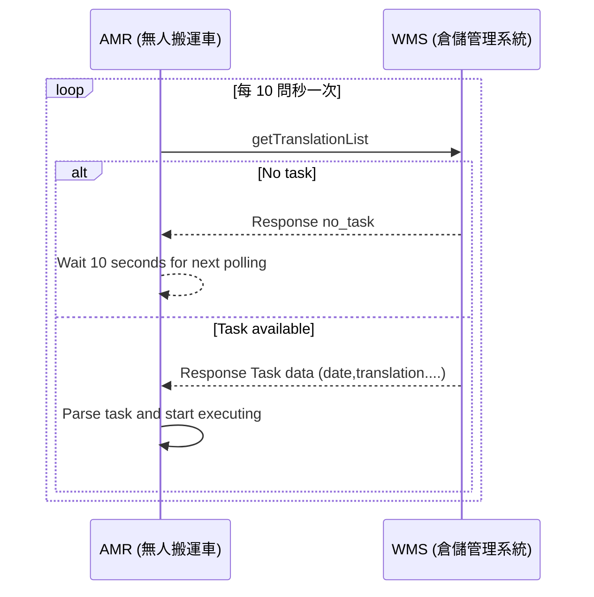
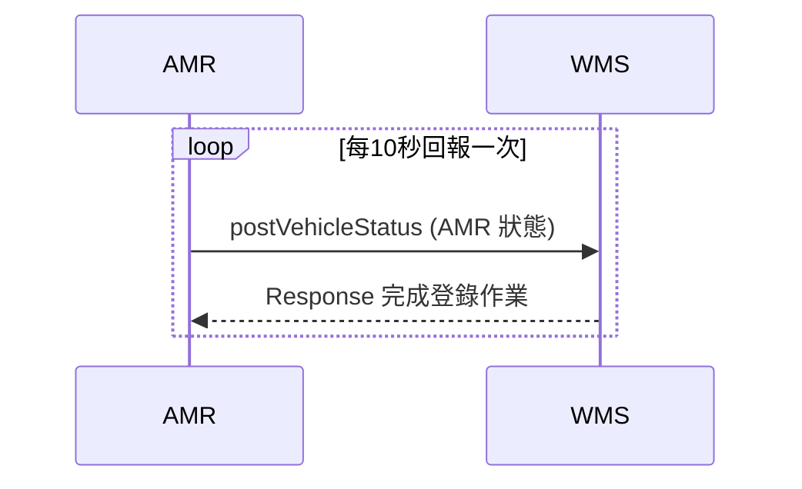

# AMR 派車系統規格書（HTTPS 通訊版）
---
## 1. 總覽
本規格書定義了自動搬運車（AMR）與倉儲管理系統(WMS)之間的 HTTP 通訊協定。倉儲管理系統(WMS)作為伺服器端，自動搬運車（AMR）作為客戶端，透過WebAPI進行通訊，使用HTTP協議傳輸JSON格式資料。

- **通訊協定**：HTTPS
- **傳輸格式**：JSON
- **系統架構**：
  - **WMS Server**：倉儲管理系統伺服器，提供WebAPI服務。
  - **AMR Client**：自動搬運車端，主動呼叫WMS系統API。

---


## 2. API 定義
基礎URL
```
http://[WMS系統IP]:[端口]/api/
```
---
## 3. API 規格

|項目 | 說明| 類別 | 方法 |
|:------|:------|:------|:-----|
| 1| AMR取得任務清單 | getTranslationList | GET |
| 2| AMR回報位置、電量、狀態及異常| postVehicleStatus | POST |
| 3| AMR回報派遣任務狀態 |postTranslationState | POST |


### 3.1 AMR取得任務清單

每隔10秒，AMR 會主動詢問WMS取得任務清單，若任務清單資訊無異常，將會執行任務。若取得的任務清單解析後有異常，會透過postTranslationState將任務清單的異常資訊回傳給WMS，並且不會執行該項任務。

**API 端點：**
```
getTranslationList.php?STATE=0
```
**請求參數：**
```json
{
  "STATE":"任務狀態",
}
```
- **任務狀態定義：**  
  - STATE=0（尚未執行）
  - STATE=1（執行中）
  - STATE=2（已完成）
  - STATE=3（取消任務）
  - STATE=4（任務清單有異常）
  - STATE=空白（全部）

**回應範例：** 依據getTranslationList所請求的參數回應,如無帶參數(空白),請回覆全部的任務。

無任務回應範例:

```json
{
  "ret": "true",
  "message":"no_task"
}
```
有任務回應範例(若有多個任務，請依序回應):

```json
{
  "ret": "true",
  "data":
    [
        {
            "date":"12:31:05(登記時間)",
            "translation":"1(任務流水號)",
            "Start":"1001(起始點)",
            "Stop1":"1005(停靠點1)",
            "Stop2":"1007（停靠點2)",
            "End":"1001(到達點)",
            "vehicle":"1(指定搬運車編號)",
            "priority":"1(優先順序)"
            "state":"0(任務狀態)",
        },
        {
            "date":"12:31:10",
            "translation":"2",
            "Start":"2001",
            "Stop1":"2005",
            "Stop2":"2006",
            "Stop2":"2009",
            "End":"2001",
            "vehicle":"2",
            "priority":"1"
            "state":"0",
        }
    ]
}
```

- **優先順序定義：**  
  - 緊急：0 (若會優先會插入任務)
  - 普通：1（依照任務的時間順序處理)  

**取消任務：** 只能取消任務狀態**未執行**的任務，**執行中**的任務無法取消。取消任務的方式不需要重新新增任務，直接把State 狀態為0 的任務，改成 State = 3 即可取消任務。

```json
{
  "ret": "true",
  "data":
    [
        {
            "date":"12:31:05",
            "translation":"1",
            "Start":"1001",
            "Stop1":"1005",
            "Stop2":"1007",
            "End":"1001",
            "vehicle":"1",
            "priority":"1"
            "state":"3",
        }
    ]
}

```

**getTranslationList時序圖：**


---

### 3.2 AMR回報位置、電量、狀態及異常

每隔10秒，AMR 會回報WMS每一台搬運車的狀態資訊以及是否有異常。

**API 端點：**  
```
postVehicleStatus.php?VEHICLE=1&POSITION=2001&POWER=70&STATUS=2& ERROR=1
```

**請求參數：**
```json
[
  {
    "VEHCILE":"1(搬運車編號)",
    "POSITION":"2001(現在位置)",
    "POWER":"70(電量 1 - 100)",
    "STATUS":"2(搬運車狀態)",
    "ERROR":"1(異常代碼)",
  },
  {
    "VEHCILE":"2",
    "POSITION":"1005",
    "POWER":"95",
    "STATUS":"1",
    "ERROR":"0",
  }
]
```
- **搬運車狀態定義：**
  - STATUS=0（待命中）
  - STATUS=1（工作中）
  - STATUS=2（充電中）
  - STATUS=3（有異常狀況）
  - STATUS=4（無開機或連線異常）

- **異常代碼定義：**  
  - ERROR=0（無異常）
  - ERROR=1（電池電量過低）
  - ERROR=2（圖資須更新）
  - ERROR=3（有障礙物）

**回應範例：**
```json
{
  "ret": "true",
  "message": "完成登錄作業", 
}
```
**postVehicleStatus時序圖：**



---

### 3.3 AMR回報派遣任務狀態

每隔10秒，AMR 會回報WMS執行中和已完成的任務清單，若有收到的派遣任務清單格式有異常無法處理，也會透過此方式回報讓WMS掌握。

**API 端點：**
```
postTranslationState.php?VEHCILE=1&TRANSLATION=2&STATE=2&ERROR=0
```

**請求參數：**

```json
[
  {
      "VEHCILE": "1(搬運車編號)",
      "TRANSLATION": "2(任務流水號)",
      "STATE": "2(任務狀態)",
      "ERROR":"0(無異常)"
  },
  {
      "VEHCILE": "2",
      "TRANSLATION": "1",
      "STATE": "4",
      "ERROR":"2(站點不存在)"
  }
]

```
- **任務狀態定義：**  
  - STATE=1（執行中)
  - STATE=2（已完成）
  - STATE=4（任務清單有異常）

- **任務異常定義：**
  - ERROR=0（任務資訊無異常)
  - ERROR=1（站點重複)
  - ERROR=2（不存在的站點）
  - ERROR=3（指定的車號不存在）
  - ERROR=4（任務重複）
  - ERROR=5（指定的車號未開機）


**回應範例：**
```json
{
  "ret": "true",
  "message": "完成登錄作業", 
}
```

**postVehicleStatus時序圖：**


---


## 4. JSON 傳輸格式說明

JSON (JavaScript Object Notation) 是一種輕量級的資料交換格式，常用於伺服器與客戶端之間的資料傳輸。
其格式以純文字構成，易於人類閱讀與撰寫，也方便機器解析與生成。

**一、基本結構**

JSON 的資料由兩種基本結構組成：

**1.物件（Object)** : 使用 { } 括號包起來的鍵值對集合。

例如：

```json
{
  "VEHCILE": "2",
  "TRANSLATION": "1",
  "STATE": "1"
}
```

**2.陣列（Array）** : 使用 [ ] 括號包起來的有序資料集合。

例如：

```json
[
  {
      "VEHCILE": "1",
      "TRANSLATION": "2",
      "STATE": "2)"
  },
  {
      "VEHCILE": "2",
      "TRANSLATION": "1",
      "STATE": "1"
  }
]

```


**二、資料型態**

JSON 支援以下基本型態：

| 型態名稱 | 範例 | 說明 |
|-----------|--------|------|
| 字串 (String) | `"VEHCILE"` | 以雙引號包圍的文字 |
| 整數 (Number) | `100` | 可為整數或小數 |
| 布林 (Boolean) | `true / false` | 表示邏輯值 |
| 陣列 (Array) | `[1, 2, 3]` | 有序的值集合 |
| 物件 (Object) | `{"TRANSLATION":2, "STATE":2}` | 鍵值對集合 |
| Null | `null` | 表示空值或未知資料 |


**三、語法規則**

1.鍵名（Key）必須使用雙引號 "key"。

2.值（Value）可為上述任一型態。

3.鍵值對以冒號 : 分隔。

4.各鍵值對以逗號 , 分隔。

5.最外層可以是物件 {} 或陣列 []。


**四、傳輸特性**

- 編碼格式：UTF-8

- MIME Type：application/json

- 傳輸方向：AMR ↔ WMS

- 優點：結構清晰、解析效率高、跨平台相容性佳


---


## 5. 版本管理
- **版本**：v1.0.0　新建
- **最後更新**：2025-10-07
- **編制者**：Athena  
