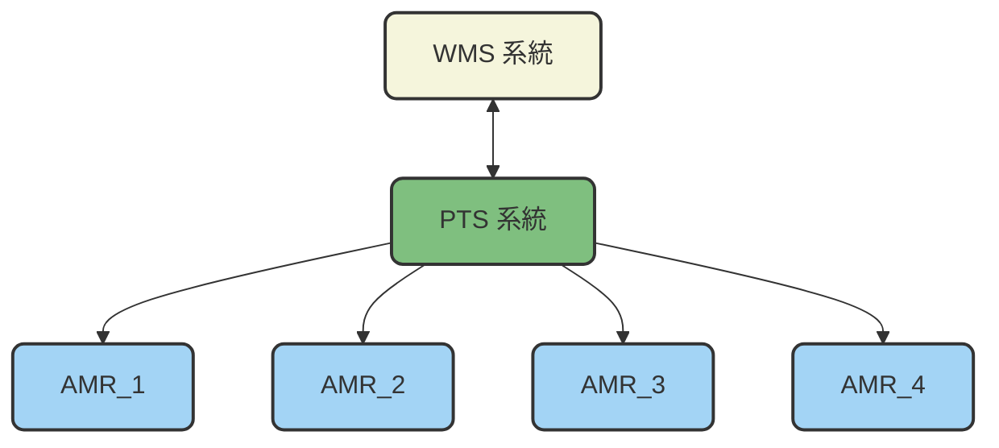
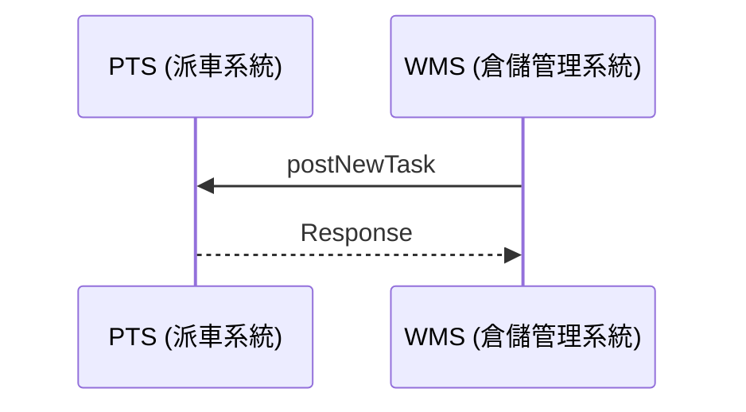
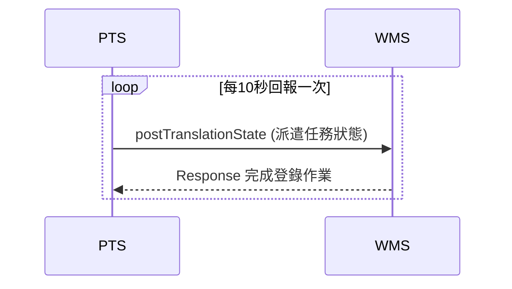
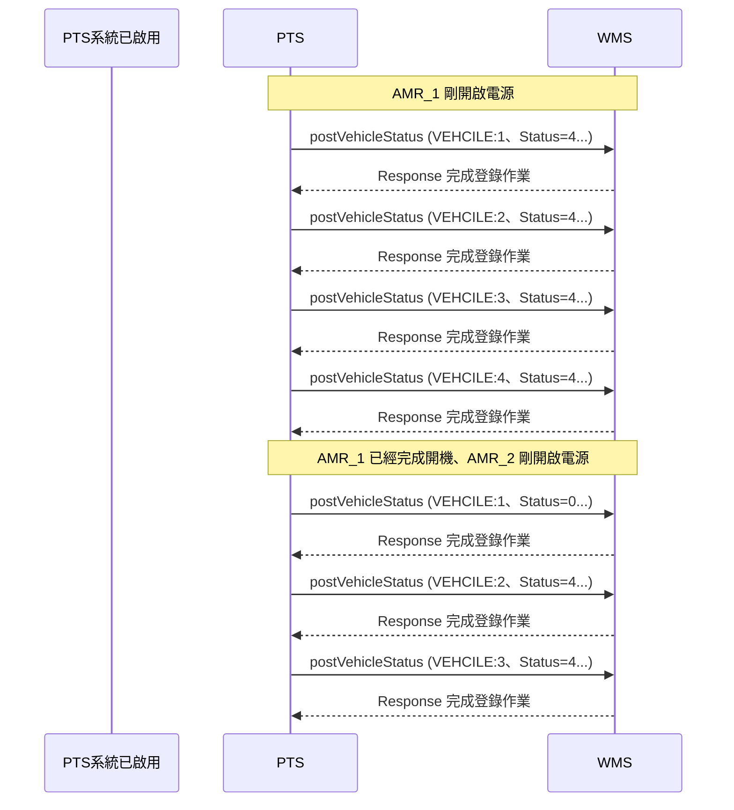
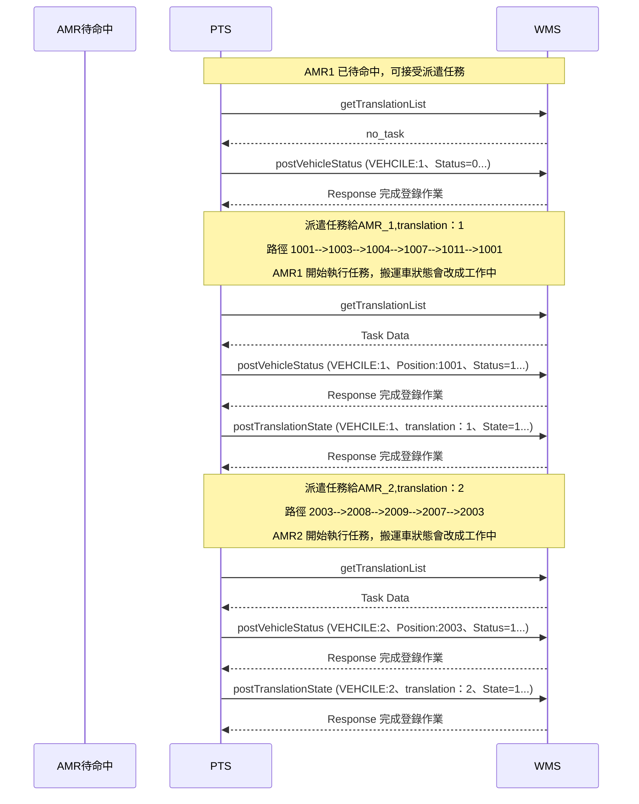
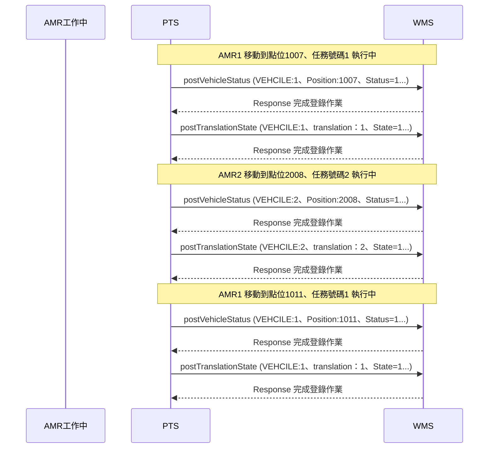
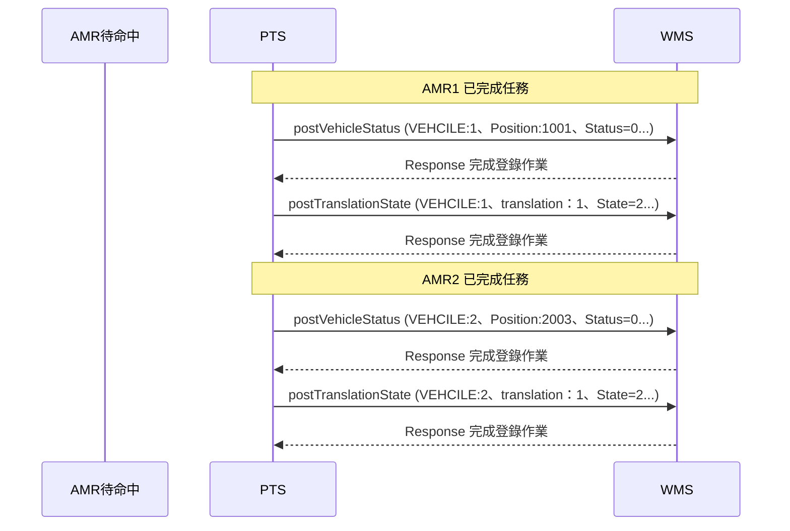
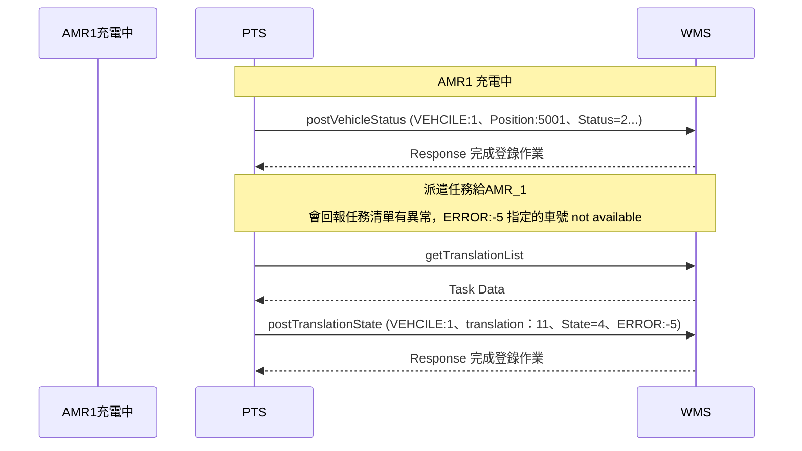

# 規劃與運輸系統 <br>Planning and Transport System（PTS） <br>和倉儲管理系統<br>Warehouse Management System (WMS)<br>HTTPS 通訊規格書

## 0. 版本管理
|版本 | 更新| 編制者 |
|:------|:------|:------|
| v1.0.0　新建| 2025-10-07 |Athena |


## 1. 總覽

本規格書定義了規劃與運輸系統（PTS）與倉儲管理系統(WMS)之間的 HTTPS 通訊協定。倉儲管理系統(WMS)與規劃與運輸系統(PTS)，透過WebAPI進行通訊，使用HTTPS協議傳輸JSON格式資料。
<br>
<br>

- **通訊協定：** HTTPS
- **傳輸格式：** JSON
- **系統架構圖：**

<br>
<br>



## 2. API 定義規格


基礎URL
```
https://[PTS系統IP]:[端口]/api/
```

|項目 | 說明| 類別 | 方法 |
|:------|:------|:------|:-----|
| 1| 新增派遣任務 | postNewTask | POST |
| 2| 取消派遣任務 | postCancelTask | POST |
| 3| 設定加班模式 |postOvertimeMode | POST |
| 4| 設定下班模式 |postOffDutyMode | POST |
| 5| 取得搬運車狀態 |getVehicleStatus | GET |

 
### 2.1 新增派遣任務

WMS 要新增任務時，由此API 處理，依據任務需求的停靠點數量填寫參數。新增派遣任務時請確認搬運車狀態，若搬運車的狀態不是待命中，將無法派遣任務。

<br>

**2.1.1 API 端點：**
```
postNewTask.php?translation=1&Start=1001&Stop1=1005&Stop2=1007&End=1001&vehicle=1
```
<br>

**2.1.2 請求參數：**

```json
{
"translation":"1(任務流水號)",
"Start":"1001(起始點)",
"Stop1":"1005(停靠點1)",
"Stop2":"1007（停靠點2)",
"End":"1001(到達點)",
"vehicle":"1(指定搬運車編號)"
}
```
- **請注意:任務流水號不可重複**

回應欄位定義 : 
<br>
- ret 正常 = true
- ret 異常 = false
- message = 異常訊息

<br>

```json
{
  "ret": "true",
  "message":"0"
}
```

```json
{
  "ret": "false",
  "message":"-1"
}
```
<br>

- **message 任務異常訊息定義：**
  - ERROR=  0（任務資訊無異常)
  - ERROR= -1（站點重複)
  - ERROR= -2（不存在的站點）
  - ERROR= -3（指定的車號不存在）
  - ERROR= -4（任務流水號重複）
  - ERROR= -5（指定的車號無法接受任務）


<br>

**2.1.3 postNewTask 時序圖：**



### 2.2 取消派遣任務

當AMR 發生重大異常無法排除時，可由WMS發送取消派遣任務的指令。

**2.2.1 API 端點：**  
```
 postCancelTask.php?translation=1
```

**2.2.2 請求參數：**
```json
  {
  "translation":"1(任務流水號)",
  }
```

<br>

```json
{
  "ret": "true",
  "message":"接受任務取消"
}
```

<br>

- **搬運車狀態定義：**
  - STATUS= 0（待命中）
  - STATUS= 1（工作中）
  - STATUS= 2（充電中）
  - STATUS= 3（有異常狀況）
  - STATUS= 4（無開機或連線異常）

- **異常代碼定義：**  
  - ERROR=  0（無異常）
  - ERROR= -1（電池電量過低）
  - ERROR= -2（圖資須更新）
  - ERROR= -3（有障礙物）

<br>


### 2.3 設定加班模式


每隔10秒，PTS會回報WMS執行中和已完成的任務清單，若有收到的派遣任務清單格式有異常無法處理，也會透過此方式回報讓WMS掌握。

**2.3.1 API 端點：**
```
postTranslationState.php?VEHCILE=1&TRANSLATION=2&STATE=2&ERROR=0
```

**2.3.2 請求參數：**

```json
[
  {
      "VEHCILE": "1(搬運車編號)",
      "TRANSLATION": "2(任務流水號)",
      "STATE": "2(任務狀態)",
      "ERROR":"0(無異常)"
  },
  {
      "VEHCILE": "2",
      "TRANSLATION": "1",
      "STATE": "4",
      "ERROR":"-2(站點不存在)"
  }
]

```

<br>

- **任務狀態定義：**  
  - STATE= 1（執行中)
  - STATE= 2（已完成）
  - STATE= 4（任務清單有異常）

- **任務異常定義：**
  - ERROR=  0（任務資訊無異常)
  - ERROR= -1（站點重複)
  - ERROR= -2（不存在的站點）
  - ERROR= -3（指定的車號不存在）
  - ERROR= -4（任務流水號重複）
  - ERROR= -5（指定的車號 not available）

<br>
<br>

**2.3.3 回應範例：**
```json
{
  "ret": "true",
  "message": "完成登錄作業", 
}
```
<br>
<br>
<br>

**2.3.4 postVehicleStatus時序圖：**



### 2.4 設定下班模式

<br>
<br>


### 2.5 取得搬運車狀態

<br>
<br>


## 3. 操作情境<br>3.1 Alive 
WMS 要下任務前，須先確認PTS系統已經啟用，PTS啟用後每隔10秒就會回報每台搬運車的狀況，請確認每台AMR 電源皆已開啟。<BR>
若搬運車已經就緒，Status=0 ，若未開啟電源，Status=4。

<br>




### 3.2 派遣任務

確認每台搬運車都變成 Status=0，即可開始派遣任務，派遣時請依照車子所在位置指定車號執行任務。

<br>



### 3.3 回報任務狀態及搬運車的狀態

每台搬運車開始執行任務後，會不斷回報位置、電量、狀態，也會回報派遣任務狀態。

<br>




### 3.4 完成任務

每台搬運車開始執行完成任務後，會回報派遣任務狀態 State=2，並且將搬運車狀態變更為待命中。

<br>



### 3.5 充電

當搬運車電量低於30％時，搬運車會去充電，此時搬運車無法接收任務。

<br>



## 4. JSON 傳輸格式說明


JSON (JavaScript Object Notation) 是一種輕量級的資料交換格式，常用於伺服器與客戶端之間的資料傳輸。
其格式以純文字構成，易於人類閱讀與撰寫，也方便機器解析與生成。
<br>

**一、基本結構**

JSON 的資料由兩種基本結構組成：

**1.物件（Object)** : 使用 { } 括號包起來的鍵值對集合。

例如：

```json
{
  "VEHCILE": "2",
  "TRANSLATION": "1",
  "STATE": "1"
}
```

**2.陣列（Array）** : 使用 [ ] 括號包起來的有序資料集合。

例如：

```json
[
  {
      "VEHCILE": "1",
      "TRANSLATION": "2",
      "STATE": "2)"
  },
  {
      "VEHCILE": "2",
      "TRANSLATION": "1",
      "STATE": "1"
  }
]

```

<br>

**二、資料型態**

JSON 支援以下基本型態：

| 型態名稱 | 範例 | 說明 |
|-----------|--------|------|
| 字串 (String) | `"VEHCILE"` | 以雙引號包圍的文字 |
| 整數 (Number) | `100` | 可為整數或小數 |
| 布林 (Boolean) | `true / false` | 表示邏輯值 |
| 陣列 (Array) | `[1, 2, 3]` | 有序的值集合 |
| 物件 (Object) | `{"TRANSLATION":2, "STATE":2}` | 鍵值對集合 |
| Null | `null` | 表示空值或未知資料 |

<br>

**三、語法規則**

1.鍵名（Key）必須使用雙引號 "key"。

2.值（Value）可為上述任一型態。

3.鍵值對以冒號 : 分隔。

4.各鍵值對以逗號 , 分隔。

5.最外層可以是物件 {} 或陣列 []。

<br>

**四、傳輸特性**

- 編碼格式：UTF-8

- MIME Type：application/json

- 傳輸方向：AMR ↔ WMS

- 優點：結構清晰、解析效率高、跨平台相容性佳


<br>

## 5. HTTPS 傳輸規範說明


**一、傳輸協定**

系統採用 HTTPS（Hypertext Transfer Protocol Secure） 作為通訊協定，確保資料在 AMR 與 WMS 之間傳遞時具備加密與完整性保護。

| 項目 | 說明 |
|:-----------|:--------|
| 通訊協定	| HTTPS（基於 HTTP over TLS）| 
| 埠號（Port）	| 預設為 443| 
| 加密層	| TLS 1.2 或以上版本| 
| 資料格式	| JSON| 
| 傳輸方向	| 雙向（AMR ↔ WMS）| 

<br>

**二、安全機制**

1.TLS 加密傳輸
  - 所有通訊內容經 TLS 加密，防止攔截與竄改。
  - 不允許使用明碼 HTTP 傳輸。

2.伺服器憑證驗證
  - AMR 在連線時須驗證 WMS 伺服器的 SSL 憑證是否有效（由受信任 CA 簽發）。
  - 憑證若過期、無效或域名不符，應拒絕連線。

3.身份驗證（Authentication）
  - 若系統需求，HTTP Header 中可加入 API Token 或 Bearer Token 作為身分驗證機制。

4.資料完整性（Integrity）
  - 所有請求及回應應透過 HTTPS 保證資料未被竄改。

<br>
<br>
<br>

**三、HTTP通用狀態碼**

| 狀態碼 | 說明 | 處理方式 |
|:-----------|:--------|:--------|
| 200	| 成功	| 無需重試| 
| 400	| 請求格式錯誤	| 檢查 JSON 結構| 
| 401	| 驗證失敗	| 檢查 Token 是否有效| 
| 404	| 資源不存在	| 檢查 API 路徑| 
| 500	| 伺服器內部錯誤	| 等待後重試| 
